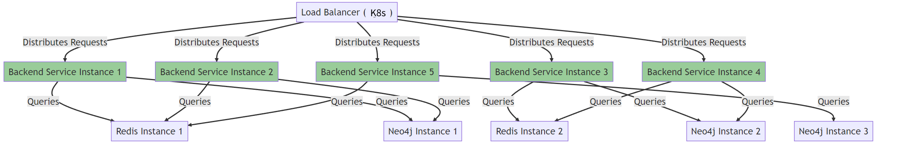

# Competition Graph Web App Design Doc

## Functional Requirement

* Backend Service
  * The backend service should be able to query and serve relationship data between public companies in the form of graph data.
    * Company relationship includes these relationships: competition, product, and unknown
  * The backend service should expose RESTful web APIs for other services
    * Client services typically includes machine learning model training services
    * The backend service should support relationship query by company names, tickers, and types of relationships. Typical usecase should include:
      * Listing companies and their relationships (currently support members of DOW30 and SP500)
      * Listing relationship of a company (competition, product, and unknown )
      * Being able to list all companies that are competitors of each other. Also, it should be able to list all competitors of a specific company.
* Frontend Service
  * The frontend service should provide visualization and interaction for users to understand the relationships between public companies.
    * The frontend service should allow users to search a company by name or ticker and show its relationship with other companies
    * The frontend service should allow users to specify the layers of relationship expansion. For example, if users only want to expand 2 layers of relationships, then only companies that are at most 2 jumps away from the searched companies will be displayed.

## Critical User Journey

1. Firstly, users will see the abstract of the Competition Graph Paper to get an idea of how the competition graph is extracted. Then user can click on the "Try it out" button to try this app
2. Users will fill a form instructing the system which company they want to view. Some recommended tickers are provided, e.g. MSFT, AMZN, AAPL, etc. Users will also tell the system how many layers of relationship to expand, and the number of nodes to view. Then users click on the submit button to view the graph. The frontend will submit users' requests to the backend. If the company ticker entered is found, the backend will return the graph data, and page will be redirected to the graph visualizer. Otherwise, the backend will report an error indicating that the company is not found.. The frontend will display the error message.
3. In the graph visualizer, users can click, select and drag the graph. Users can also zoom in or zoom out. If the clicked node is a company, the frontend will send a request to fetch nodes connected to that company. If successful, the graph node will expand to display the competitors of that company. Otherwise, the frontend does nothing. If the node is already expanded, then all nodes connecting to that node will collapse and become hidden.

<p style="text-align:center"></p>

## Non-Functional Requirement

* **Performance:**  The service should be able to handle frequent requests from other services without performance degradation. Key performance metrics include:

  * **Response Time** : The average response time for API requests should be under 200 milliseconds under normal load.
  * **Throughput** : The service should be able to handle at least 10k requests per second under peak load.
  * **Special Requirement:** The service should be able to handle a sudden surge of large concurrent requests, and should not fail to response for 99.99% of the time.
* **Scalability** : The service should be scalable to handle increasing data volume and request load. Key scalability metrics include:

  * **Load Scalability** : The service should maintain its performance characteristics even when the number of simultaneous users or requests doubles.
  * **Data Scalability** : The service should be able to handle a 10x increase in the number of public companies and relationships without a significant increase in response time.
* **Availability:**  The service should be highly available to ensure uninterrupted service to users. Key availability metrics include:

  * **Uptime** : The service should aim for an uptime of 99.99% ("Four Nines"), which allows for approximately 52.56 minutes of downtime per year, not including planned maintenance.
  * **Failover** : In case of a system failure, the service should be able to automatically failover to a backup system within minutes.
* **Security(not included in the scope of this document, require a common security service)**

## Web API

The service will expose a RESTful API with the following endpoints:

1. GET `/relationship/<company_name: str>/<relationship_type: 'comp' | 'prod' | 'unknown' | none>`
   1. Returns a list of companies by relationship type
   2. Params:
      1. `company_name: str`,
      2. `relationship_type: 'comp' | 'coop'`,
         1. `'comp'`: competition
         2. `'product'`: cooperation
         3. `'unknown'`: other relationships
         4. `none`: returns all relationships
   3. Returns
      1. graph
         1. `nodes: List[{ id: int, name: str }]`
         2. `links: List[{ id: int, category: 'competition' | 'product' | 'unknown', source: int, target: int }]`


The service will also provide an bidirectional websocket API.

If you are not familiar with websocket, here are some resources:

1. [MDN Websocket Documentation](https://developer.mozilla.org/en-US/docs/Web/API/WebSockets_API/Writing_WebSocket_client_applications)
2. [FastAPI Websocket Server](https://fastapi.tiangolo.com/zh/advanced/websockets/)
3. [Python Websocket Library](https://websockets.readthedocs.io/en/stable/)

API: /ws/company-relation

Body:

`{'company_name': None|str, 'relationship_type': 'comp' | 'prod' | 'unknown' | none }`

Returns

1. graph
2. `nodes: List[{ id: int, name: str }]`
3. `links: List[{ id: int, category: 'competition' | 'product' | 'unknown', source: int, target: int }]`

## Architecture

<p style="text-align:center"></p>

## Critical User Journey

1. **Discovery and Onboarding** : A user discovers the company relationship query service. They are greeted with a short description of the project and instructions on how to use the service on the first page of the frontend.
2. **First Use** : The user clicks on the 'try it out' button to experience the service. They are presented with a form where they can enter the name or stock ticker of the company they want to view. They can also select the category of relationship and the number of layers to expand.
3. **Visualization** : Upon successful submission of the form, the frontend renders a graph visualizer. The visualizer displays the relationships of the company in a graph format. Users can interact with the graph by selecting, clicking, expanding, or collapsing nodes and relationships. They can also drag the graph for better viewing.
4. **Interaction** : When a user clicks on a node in a collapsed state, the frontend attempts to expand its relationship. This triggers a web request to the backend.
5. **Update** : If the request to the backend is successful, the frontend updates the graph to display the expanded relationship. The user can continue to interact with the graph and explore the relationships.


## UI Design

(For reference only. May not represent the final product.)


## Architectural Design

The service will adopt a microservices architecture, with distinct backend and frontend services. Both services will be designed with a focus on high availability and fault tolerance.

### Backend Architectural Design



The backend service will be developed using a graph database(Neo4j) and Python. It will be designed as a distributed system and deployed using container services for high availability and scalability. **To optimize query performance, we can optionally deploy a redis service to cache frequent queries.** The key could be the request parameters like "company_name={name}&rel={comp|prod|unknown|none}", and the value is the data returned by the backend.

#### Distributed System

The backend service will be designed as a distributed system with multiple instances running in parallel. This design allows the service to handle a large number of requests and ensures high availability.

#### Container Services

The backend service will be deployed using Docker, and orchestrated using Kubernetes (k8s). This allows for easy deployment, scaling, and management of the service.

1. **Containerization** : Each microservice will be packaged into a docker container. This includes all the dependencies needed by the microservice, ensuring consistency across all environments.
2. **Orchestration** : The containers will be managed and orchestrated using Kubernetes. Kubernetes provides features like automatic scaling, rolling updates, and self-healing (restarting containers that fail), which are crucial for high availability and scalability.

#### Database Deployment

Initially, the database could be deployed as a single node for the sake of simplicity. Then it could scale to multiple replicas upon higher request demands. In that case, the graph database will be set up as a cluster with multiple replicas. This ensures that even if one database instance goes down, the others can continue to serve data.

1. **Replication** : The database will be replicated across multiple instances. This ensures high availability as even if one instance goes down, the others can continue to serve data. There will be one core instance and two read replica.

### Monitoring and Alerting

To ensure the high availability of the service, a robust monitoring and alerting system will be implemented. This system will continuously monitor the health of the servers and the database, and send alerts in case of any issues. This allows for quick detection and resolution of any problems, minimizing downtime.

## DB Design

**DB Choice: Neo4j**


**Nodes:**

1. **Company** : This node represents a company. Properties:

* `name`: The name of the company.
* `ticker`: The stock ticker symbol of the company.
* `industry`: The industry the company operates in.

2. Product: Represents the product of a company. Properties:

* `name`: The name of the product

3. Item: Other unknown item

* `name`: The name of the item

**Relationships:**

1. **COMPETES_WITH** : This relationship represents a competitive relationship between two companies.
2. **PRODUCT_OF** : This relationship represents the item
3. **Unknown** : This relationship represents all other unknown relationships.

##### Index Design

**Company Nodes** : You might frequently query for companies based on their `name` or `ticker` properties

```sql
CREATE INDEX FOR (c:Company) ON (c.name)
CREATE INDEX FOR (c:Company) ON (c.ticker)
```

**Product Nodes** :

```SQL
CREATE INDEX FOR (p:Product) ON (p.name)
```

**Item Nodes:**

```sql
CREATE INDEX FOR (i:Item) ON (i.name)
```

### Key Assumptions and Trade-offs

#### **Key Assumptions:**

1. **Data Availability** : The system assumes that the data about companies and their relationships is available and can be obtained in a structured format that can be imported into Neo4j.
2. **Data Quality** : The system assumes that the data is accurate and up-to-date. If the data is not reliable, the results provided by the system will also be unreliable.
3. **User Load** : The system assumes that the load will be manageable with the proposed architecture. If the number of users or the rate of requests is significantly higher than expected, the system might need to be scaled up or ou
4. **User Behavior** : The system assumes that users will interact with the system in certain ways (e.g., by querying for specific companies, by exploring the graph visualization). If users interact with the system in unexpected ways, it might affect the performance or usability of the system.

#### **Key Trade-offs:**

1. **Complexity vs. Performance** : Using a graph database like Neo4j allows for efficient querying of complex relationships, but it also adds complexity to the system compared to a more traditional relational database.
2. **Scalability vs. Consistency** : In a distributed system, there is often a trade-off between scalability and consistency. For example, adding more replicas can increase read scalability but can also lead to consistency issues.
3. **Cost vs. Performance** : Higher performance often comes with higher costs, both in terms of the resources needed (e.g., more powerful servers, more storage) and the complexity of the system (e.g., implementing caching, load balancing, replication).
