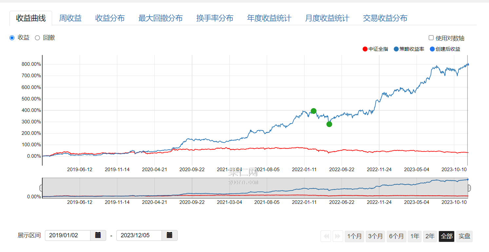

# WRDS Stock Ranking Query System High-Level Design

## Design Objective

The goal of this document is to provide detailed guidance and  specification for the development of the WRDS Stock Ranking Query System. WRDS Stock Ranking Query System is a subsystem of the WRDS Stock Ranking System that consists of a data ingestion system and a query system. The design objective of whole system is to recommend stocks and to help users forming their own strategies based on a set of stock ranking factors. While the data ingestion system handles data ingestion and calculation, this subsystem is primary responsible for providing views and queries of stock rankings to users. This document includes many aspects of the system, including architecture, data models, factor specification,

## Background

The Stock Ranking system, hereinafter referred to as "the System," represents a crucial tool for investors and financial professionals seeking to make data-driven investment decisions. The System is designed to efficiently collect, process, and analyze a vast amount of financial data, including historical stock prices, market indicators, and various financial metrics. This background section provides an overview of the motivations and context driving the development of the System.

### Motivation

In today's rapidly evolving financial markets, the ability to make informed investment decisions is paramount. Access to comprehensive and accurate financial data is essential for investors to identify trends, assess risk, and seize opportunities. Traditional data processing and analysis methods often struggle to handle the ever-increasing volume of financial data generated daily. As a result, there is a growing need for a robust and high-performance financial analysis system that can efficiently process and analyze large datasets to support investment strategies.

### **Context**

The System is being developed in response to the challenges and opportunities presented by the financial industry. With the advent of online trading platforms, algorithmic trading, and the democratization of financial information, investors and financial professionals are increasingly relying on technology to gain a competitive edge in the market. However, these technological advancements also pose the challenge of handling massive datasets while ensuring data accuracy, integrity, and availability.

To address these challenges, the System leverages the Hadoop ecosystem  like Hive and Spark for OLAP workloads. The Hadoop ecosystem provides mature component to support data intensive usecases, allowing the System to provide users with timely and actionable insights for investment decision-making.

## Overview

This document aims to analyze the platform and give a tentative breakdown of each of its components. It starts with analyzing problem requirements and then breaks down the platform step by step. A couple of solutions will be discussed for sub-components, which will be analyzed later in more specific designs. Finally, a road map will be provided for this project.

## Requirement

### Functional Requirement

#### Stock ranking

* Users can select a range of filter conditions and ranking factors to form a ranked list of stocks
  * Users can choose the date of data to rank stocks
    * The date is set to the latest trading date by default
    * Users can also choose a past date
      * The future return will be listed in the result
        * 1-day return
        * 5-day return
        * 20-day return
  * Users can adjust the threshold values of filter conditions
    * A pool of stocks will be filtered and selected from these filter conditions
    * Then this pool of stocks will be ranked based on the weighted sum of ranking scores
  * Users can adjust the weight of each ranking factors
  * Users can view the ranking result based on the ranking scores
    * the ranking score is ranged from 0 - 100
    * Users can select the direction of the ranking
      * High to Low
      * Low to High
    * the ranking score is calculated by a weighted sum of all ranking factors
      * the value of ranked factors of each stock is converted to rank score
        * rank score = (n_stocks - rank of stock + 1) / n_stocks *100
      * final rank score = weight_1 * rank_score_on_factor_1 + weight_2 * rank_score_on_factor_2 + ... + weight_n * rank_score_on_factor_n
      * If a stock has no valid ranking factor value, it will get a rank score of 0
* Users can adjust the number of stocks to display in the final result
  * default to 20
  * some quick options
    * 10
    * 20
    * 50
    * 100
    * no limit
* Users can view and export the ranking result as excel file
  * The result includes the following items
    * stock ticker
    * stock name
    * close price
    * volume
    * weighted sum of ranking score
    * value of rank factor 1
    * value of rank factor n (if any)
    * ranking score of factor 1
    * ranking score of factor n (if any)

#### Factor Customization (Advanced Requirement)

This requirement is planned to be implemented in multiple stages as it is quite complicated.

* Users can customize their own factors based on system built-in factors and data
  * Stage 0: Proof of concept, internal configuration only
    * provide a internal interface to manage factors
    * Admin can write computation script (python / sql) to generate factors
  * Stage I: Only support factor building with basic arithmetic operations
    * Add, Subtract, Multiply, Division
    * If factors do not have the same time period, all of them must be downscaled to the one with the lowest frequency
  * Stage II: Support predefined functions
    * Such as:
      * Mean
      * Max
      * Min
      * Zscore
      * Standardize

#### Representative User-Journey

A user wants to get the top 20 stocks based on the Quick Ratio, ROE and EV/EBITDA in order to assess stocks in terms of debt repayability, profitability, and valuation. The user want to exclude stocks with market cap under $100 million. He or she select "market cap" as the filter condition, select the condition to be "larger or equal to", and enter $100 million. Then the user select "Quick Ratio, ROE and EV/EBITDA" as ranking factors. Equal weights are given to all factors. All factors are set to rank in descending order. When the user submit the request, the ranking will be calculated by the weighted sum of all ranking scores of the chosen factors. Then the user can view the result includingh tickers, names, ranking scores, and factor scores. The user can also export the result as excel.

#### Stock Ranking Factors

##### Fundamental

* Valuation
  * P/E
    * yearly
    * TTM
  * P/B
  * EV / EBITDA
  * PEG
  * EP
  * BP
* Debt Repayability
  * Quick Ratio
  * Current Ratio
  * Debt / Asset
* Capital Structure
  * Equity / Asset
  * Fixed asset / Asset
* Profitablility
  * Revenue / Income
  * Net Income / Revenue
  * Gross Income / Revenue
  * Net Income / Asset
  * Net Income / Equity
  * ROIC
* Operation Efficiency
  * Account Receivable Turnover Rate
  * Current asset turnover rate
  * Inventory turnover rate
* Growth
  * Revenue growth
  * Net income growth
  * Gross income growth
  * Net asset growth
  * Net Income 3-year CAGR
  * Net Income 5-year CAGR
* Per share metrics
  * Earning per share
  * dividend per share
  * Free Cash Flow per share

##### Trade

1. Price and Volume (OHLCV)
2. MA (1 day, 5 day, 20 day)
3. Momentum (1 day, 5 day, 20 day)
4. turnover rate (1 day, 5 day, 20 day)
5. market cap
6. macd dif (1 day, 5 day, 20 day)
7. volatility (1 day, 5 day, 20 day)

### Non-Functional Requirement

* The system should be adaptable and compatible with multiple existing strategies/data processing workflow.
* It should be scalable, such that a massive amount of data could be injected and processed.
* The platform should be reliable, client should have no problem accessing the ranking result.

#### Performance

* For ranking queries, we have around 8000 companies' data and 2 to 150 combined factors in general. We’d like to target 1,000 query requests per second (QPS) in the first stage.
* When requests arrive, we aim to get it around 100ms, either by smart computation or caching.

## System Architecture

### High-Level Overview

The Stock Ranking Query System consists of four microservices:

* Factor Manager
* Stock Ranker
* Stock Pool Manager
* Portfolio Manage

**Factor Manager:**

- Manages a dynamic catalog of stock ranking and filtering factors.
- Allows users to create custom factors using a formula editor that supports arithmetic operations and references to other factors.
- Provides a user interface for browsing and searching available factors.
- Ensures the integrity of factor definitions and dependencies.

**Stock Ranker:**

- Receives queries from users to rank stocks based on selected factors.
- Utilizes a high-performance computation engine to process large volumes of stock data.
- Offers various ranking algorithms, including weighted scoring and machine learning models.
- Supports real-time and batch processing modes for different use cases.

**Stock Pool Manager:**

- Curates and manages a collection of stock pools, based on SP500 or DOW30 indexes, or categorized pools such as blue-chip stocks, tech sector stocks, or value stocks.
- Allows users to define their own stock pools based on specific criteria or filters.
- Integrates with external data sources to update stock pools based on market changes.
- Provides APIs for other system components to retrieve and subscribe to stock pool updates.

**Portfolio Analyzer:**

- Tracks the historical and real-time performance of stock rankings and user portfolios.
- Offers analytical tools to compare the performance against benchmarks or indices.
- Allows users to set up alerts based on portfolio performance metrics.
- Generates detailed reports with insights into portfolio diversification, risk, and returns.

**Data Digestion System (Not in the scope of this project)**

- Acts as a backbone for the system, ingesting and normalizing data from various stock exchanges and financial data providers.
- Ensures data quality and consistency through validation, cleaning, and transformation processes.
- Provides a scalable storage solution to handle the vast amounts of incoming financial data.
- Facilitates data accessibility for the microservices through a well-defined API.

**Infrastructure :**

- Built on a robust cloud infrastructure to ensure scalability, reliability, and security.
- Implements containerization and orchestration for microservices deployment and management.
- Employs a combination of relational and NoSQL databases optimized for different data access patterns.
- Features a comprehensive monitoring and logging system to track system health and performance.

### System Component Design

**Stock Ranking Web App:**

- **Factor Panel:** Allows users to browse, select, and manage the factors used in stock ranking. Users can create custom factors by defining formulas or expressions.
- **Rank Condition Selector:** Enables users to set conditions and criteria for stock ranking, like thresholds or specific factor weightings.
- **Stock Pool Selector:** Provides a user interface for selecting predefined pools of stocks or for creating custom pools based on user-defined criteria.
- **Ranking Panel:** Displays the results of stock rankings based on selected factors and conditions. Users can sort, filter, and analyze the ranking results.
- **Portfolio Tracker:** Tracks the performance of user portfolios over time and provides insights into gains, losses, and other relevant metrics.
- **Account Management:** Manages user accounts, including authentication, authorization, preferences, and settings.

**API Gateway:**

- Serves as an entry point for the web application, routing requests to the appropriate services in the application layer and aggregating the results for the web app.

**Application Layer:**

- **Factor Manager:** Manages the lifecycle of ranking factors, including creation, update, and deletion of factor definitions.
- **Stock Ranker:** Processes ranking requests by applying factors and conditions to generate a ranked list of stocks.
- **Stock Pool Manager:** Manages the different pools of stocks, including their creation, update, and deletion based on defined criteria.
- **Portfolio Manager:** Handles operations related to portfolio management, including tracking performance and managing portfolio compositions.

**Domains:**

- **Factor Domain:** Contains the business logic related to ranking factors and their management.
  In the Factor Domain, the aggregate could be designed to manage the lifecycle and rules around the factors used for stock ranking. An aggregate in this context would typically include the factor definitions along with the rules and logic for how factors are created, updated, and applied. Here is a potential design for a Factor Domain aggregate:

  **FactorAggregate:**

  **Root Entity: Factor**

  - **Identifier:** Unique identifier for the factor (e.g., factor ID).
  - **Name:** The name of the factor, which would be recognized by users and within the system.
  - **Description:** A detailed description of what the factor represents and how it is calculated.
  - **Expression:** The formula or computation expression used to calculate the factor's value.
  - **Metadata:** Additional information about the factor, such as its data sources, update frequency, and applicability.

  **Value Objects:**

  - **FactorMetadata:** Encapsulates all metadata related to the factor, including tags, category, and creation date.
  - **FactorValue:** Represents the calculated value of a factor for a given stock at a specific point in time.
  - **FactorFormula:** An object that defines the computational logic for the factor, possibly including references to other factors.

  **Entities:**

  - **FactorDependency:** Represents other factors or inputs that the current factor depends on for its calculation.

  **Services:**

  - **FactorCalculationService:** A domain service that takes in a stock or set of stocks and computes the value of the factor for each one.
  - **FactorValidationService:** Validates the expression/formula of the factor to ensure that it is logically and mathematically correct.

  **Repositories:**

  - **FactorRepository:** Manages the persistence of Factor aggregates, providing the ability to retrieve, update, and store factors.

  **Domain Events:**

  - **FactorCreated:** An event indicating that a new factor has been defined and is now available for use.
  - **FactorUpdated:** An event signaling that a factor has been modified, which could potentially trigger re-calculation of rankings that use this factor.
  - **FactorDeleted:** An event that denotes the removal of a factor from the system.

  **Example Scenario:**
  When a user defines a new factor, the system would instantiate a new `Factor` entity as the root of the `FactorAggregate`. The `FactorCalculationService` could be invoked to test the calculation expression, ensuring that it is valid and executable. The `Factor` entity would be populated with its `Name`, `Description`, `Expression`, and `Metadata`. The `FactorRepository` would then be used to persist the new factor. The creation of the factor would also raise a `FactorCreated` domain event, which other parts of the system might listen to in order to update their own state or perform further operations, such as recalculating stock rankings if necessary.
- **Ranker Domain:** Encapsulates the logic for the ranking process, including the application of algorithms and factor weightings.

  - Aggregate
    - RankingProcess
      - Represent the state and progress of a ranking task
      - Fields
        - **ID**
        - **State**: Pending, In-Progress, Completed
        - **Parameters**: Includes all the parameters necessary for the ranking (e.g., selected factors, weights, and conditions).
        - **Result:** The outcome of the ranking process, typically a list of ranked stocks with their scores.
      - supported operations
        - submit
        - get_state
        - cancel
        - get_result
  - Entities
    * **RankedStock:** Represents a single stock within a ranking, including its score and any relevant details specific to the ranking.
    * **RankingFactor:** Represents a factor used in the ranking process. It includes the factor definition and its weight.
  - Value Objects
    * **FactorScore:** A value representing the score of a stock for a particular factor.
    * **RankingCriteria:** A set of conditions and rules that define how the ranking is performed.
  - **Repositories:**
    - **RankingProcessRepository:** A repository responsible for persisting and retrieving RankingProcess aggregates.
  - **Domain Events:**
    - **RankingInitiated:** An event indicating that the ranking process has started.
    - **RankingCompleted:** An event indicating that the ranking process has been completed, and the results are available.
  - **Example Scenario**:
    - When a user requests a stock ranking, the application service would create a new RankingProcess entity and set it as the root of the RankingAggregate. It would then use the RankingCalculator to compute the scores of stocks based on the provided RankingCriteria. As the calculation proceeds, RankedStock entities would be created and associated with the RankingProcess. Once the process is completed, the RankingCompleted event would be published, and the results would be persisted using the RankingProcessRepository.
- **Stock Domain:** Represents the domain logic for managing stock-related information, such as stock details, price history, and metadata.

  **StockAggregate:**

  **Root Entity: Stock**

  - **Identifier:** Unique identifier, such as a ticker symbol.
  - **Company Information:** Details about the company, including name, sector, industry, etc.
  - **Financials:** Financial data related to the stock, such as earnings, dividends, balance sheet items.
  - **Price History:** Historical price data, including open, close, high, low, and volume for different time frames.
  - **Current Metrics:** Real-time data such as current price, volume, and changes.

  **Value Objects:**

  - **StockPrice:** Contains the price information for a stock at a given moment, encapsulating open, close, high, low, and volume.
  - **FinancialIndicator:** Represents a specific financial metric of the stock, like P/E ratio, market cap, or debt/equity ratio.
  - **StockMetadata:** Additional metadata about the stock, such as the exchange it's listed on, its market cap category (small-cap, mid-cap, large-cap), etc.

  **Entities:**

  - **HistoricalDataPoint:** Represents a single point of historical data for the stock. It can be part of a time series for price history or other time-varying metrics.

  **Services:**

  - **StockValuationService:** A domain service that might be responsible for computing various valuations and derived metrics for a stock.
  - **StockUpdateService:** Manages the updating of stock information, either in real-time or via periodic batch jobs, depending on the nature of the data.

  **Repositories:**

  - **StockRepository:** Responsible for persisting and retrieving Stock aggregates. This would handle CRUD operations and queries related to stock entities.

  **Domain Events:**

  - **StockPriceUpdated:** An event that is raised when the price of a stock is updated.
  - **FinancialsUpdated:** An event that is raised when new financial information for a stock is available.

  **Example Scenario:**
  A user or automated system requests the latest information on a stock. The `StockUpdateService` retrieves real-time data from an external source, updating the `Stock`'s `Current Metrics` and `Price History`. The `StockValuationService` may then compute real-time valuation metrics based on the new data. Once the updates are made, the `StockPriceUpdated` event is published, which could trigger other parts of the system, such as the Stock Ranker, to re-evaluate rankings that include this stock. The `StockRepository` is used throughout to retrieve and persist changes to the Stock aggregate.
- **Portfolio Domain:** Governs the rules and operations related to portfolio management, performance tracking, and analytics.

  **PortfolioAggregate:**

  **Root Entity: InvestmentPortfolio**

  - **Identifier:** A unique identifier for the portfolio, such as a portfolio ID.
  - **Owner:** Information about the owner of the portfolio, which could be linked to a user account.
  - **Holdings:** A collection of stock holdings, each representing a stock owned within the portfolio, including the number of shares and the price at which they were bought.
  - **Cash Position:** The amount of liquid cash available in the portfolio for new investments or as a buffer.
  - **Performance Metrics:** Aggregated data representing the portfolio's performance, like total return, risk metrics, and benchmark comparisons.

  **Value Objects:**

  - **Holding:** A value object representing an individual stock within the portfolio, including the quantity owned and the purchase information.
  - **Transaction:** Represents a buy or sell order within the portfolio, capturing the stock, quantity, price, and date.
  - **PortfolioValue:** Represents the total value of the portfolio, calculated from the sum of all holdings and the cash position.

  **Entities:**

  - **PortfolioHistory:** Represents the historical performance of the portfolio, with data points capturing the portfolio's value at different times.

  **Services:**

  - **PortfolioValuationService:** A domain service responsible for calculating the current valuation of the portfolio based on the market prices of the holdings and cash position.
  - **PerformanceAnalysisService:** Analyzes the performance of the portfolio, comparing it to benchmarks and calculating metrics like volatility, alpha, and beta.

  **Repositories:**

  - **PortfolioRepository:** Manages the persistence of InvestmentPortfolio aggregates, including retrieving, updating, and storing portfolio data.

  **Domain Events:**

  - **StockAddedToPortfolio:** An event raised when a new stock is added to the portfolio.
  - **StockRemovedFromPortfolio:** An event raised when a stock is removed from the portfolio.
  - **PortfolioRebalanced:** An event raised when the portfolio is rebalanced, signaling that holdings have been adjusted to meet the desired asset allocation.

  **Example Scenario:**
  When a user decides to rebalance their portfolio, the `InvestmentPortfolio` initiates a rebalancing operation. The `PortfolioValuationService` recalculates the value of the portfolio, while the `PerformanceAnalysisService` updates performance metrics. Transactions are generated for each buy and sell operation, and the `Holdings` are updated accordingly. As each transaction is processed, corresponding events such as `StockAddedToPortfolio` or `StockRemovedFromPortfolio` are published. Once the rebalancing is complete, a `PortfolioRebalanced` event is raised. The `PortfolioRepository` is then used to save the new state of the `InvestmentPortfolio`.

**Repositories:**

- **Factor Repository:** Responsible for persisting factor data and providing access to factor entities.
- **Ranker Repository:** Handles persistence and retrieval of ranking computations and results.
- **Stock Repository:** Manages the storage and retrieval of stock data, including real-time and historical data.
- **Portfolio Repository:** Maintains portfolio data, including holdings, transaction history, and performance metrics.

**Infrastructure:**

- **Time Series DB:** Stores and manages time-series data like stock prices, volume, and other temporal data.
- **Relational DB:** Manages structured data, such as user information, factor definitions, and portfolio compositions.
- **Redis:** Provides in-memory data storage for fast access to frequently used data like session states, cache, and temporary computations.
- **RabbitMQ:** Handles message queuing for asynchronous processing and communication between different services and components.

**Query System External Interface Manager:**

- Manages the interfaces between the application and external query systems, ensuring the seamless flow of data and requests.

**Stock Ranking Data Digestion System:**

- Processes and normalizes raw stock data from various external sources, preparing it for consumption by the application's services.

## Database Design

The query system chooses **PostgreSQL** and its time-series supporting variant **TimescaleDB** as primary databases. Trade-offs and reasons behind this decision will be discussed in the database trade-off section.

### Table Design

#### Relational Database Design (SQL)

For structured data that requires ACID transactions, like user accounts, portfolio holdings, and factor definitions.

**Users Table**

- UserID (Primary Key)
- Username
- HashedPassword
- Email
- CreatedAt
- LastLogin

**Portfolios Table**

- PortfolioID (Primary Key)
- UserID (Foreign Key)
- Name
- Description
- CreatedAt

**Holdings Table**

- HoldingID (Primary Key)
- PortfolioID (Foreign Key)
- StockID (Foreign Key)
- Quantity
- PurchasePrice
- PurchaseDate

**Stocks Table**

- StockID (Primary Key)
- TickerSymbol
- CompanyName
- MarketCap
- Sector
- Industry

**Factors Table**

- FactorID (Primary Key)
- Name
- Description
- Expression
- CreatedAt
- UpdatedAt

**Transactions Table**

- TransactionID (Primary Key)
- PortfolioID (Foreign Key)
- StockID (Foreign Key)
- TransactionType (Buy/Sell)
- Quantity
- PriceAtTransaction
- TransactionDate

**StockFactors Table** (Associative table for many-to-many relationship between Stocks and Factors)

- StockID (Foreign Key)
- FactorID (Foreign Key)
- Value
- Timestamp

#### Time-Series Database Design (NoSQL)

For storing and querying time-series data such as stock prices, which require high write throughput and fast reads over time range queries.

**StockPriceTimeSeries**

- StockID (Link to Stocks Table)
- DateTime (Timestamp)
- OpenPrice
- ClosePrice
- HighPrice
- LowPrice
- Volume

### Cache Layer (In-Memory Data Store)

For fast access to frequently read data, such as the latest stock rankings or user sessions.

**RankingCache**

- RankingID
- Stocks (List with ranking order)
- Timestamp

**SessionStore**

- SessionID
- UserID
- Expiry

### Message Queue (For Asynchronous Processing)

To handle asynchronous tasks such as updating stock prices or processing user transactions, which do not require immediate consistency.

**TaskQueue**

- TaskID
- Type (UpdatePrice, ProcessTransaction)
- Payload (JSON)

### Considerations:

- **Scalability:** The system should be designed to scale horizontally, especially for the time-series and document stores, which will handle the bulk of the data.
- **Performance:** Indexes should be strategically used, especially in the relational database, to speed up queries, and the time-series database should be optimized for fast writes and range queries.
- **Normalization:** The relational data should be normalized to reduce redundancy, but some denormalization might be acceptable in the time-series and document stores for performance reasons.
- **Security:** Sensitive data like user passwords should be hashed, and access to the databases should be controlled with proper authentication and authorization mechanisms.
- **Data Integrity:** Foreign keys, constraints, and transactions in the relational database ensure data integrity for critical operations.

### Trade-offs

Choosing the appropriate database for an application involves considering various trade-offs in terms of features, performance, scalability, and operational complexity. For a stock ranking system, we need databases that can handle time-series data effectively. The combination of Postgres and TimescaleDB our proposed choice, with TimescaleDB being an extension to Postgres that is specifically optimized for time-series data. This enables simpler infrastructure design and the ease of maintainance, while still benefiting from the time-series supporting features.

Here are some trade-offs to consider:

### Postgres

**Pros:**

- **Maturity:** PostgreSQL is a mature, stable, and open-source relational database system with a strong community and extensive documentation.
- **ACID Compliance:** It provides full ACID compliance to ensure transaction reliability.
- **Rich Feature Set:** Postgres supports a wide range of features, including complex queries, joins, window functions, and subqueries.
- **Extensibility:** It can be extended with custom functions, data types, languages, and can use extensions like PostGIS for geospatial data.
- **JSON Support:** Offers JSON and JSONB data types, allowing for efficient storage and querying of semi-structured data.

**Cons:**

- **Performance with Time-Series Data:** While Postgres can handle time-series data, it is not optimized for this type of workload. Over time, as data grows, performance can degrade without careful design and tuning.
- **Write Amplification:** The MVCC (Multi-Version Concurrency Control) model can lead to write amplification and bloat, which requires routine maintenance like vacuuming.

### TimescaleDB

**Pros:**

- **Time-Series Optimization:** TimescaleDB is built on top of PostgreSQL and offers significant performance optimizations for time-series data.
- **Automatic Partitioning:** It handles automatic partitioning (time and space partitioning) of data, which can lead to better query performance and easier scaling.
- **Scalability:** Designed to scale out across servers and handle multi-terabyte datasets with ease.
- **Seamless Integration:** As an extension to Postgres, it supports the rich feature set of Postgres, including its SQL interface, JOINs, and more.
- **Real-Time Aggregation:** Offers continuous aggregates, which are real-time materialized views that can speed up common aggregate queries.

**Cons:**

- **Operational Complexity:** While TimescaleDB can be more complex to operate than vanilla Postgres, especially in distributed setups, this complexity is often due to the additional features it provides.
- **Relatively New:** It is newer than PostgreSQL, so while it has a growing community, it may lack the same level of community support and maturity.

### Postgres and TimescaleDB

**Pros:**

- **SQL Interface:** Both are SQL-based, which is familiar to many developers and integrates well with many existing tools and systems.
- **Rich Ecosystem:** PostgreSQL has a vast ecosystem of tools and extensions, and TimescaleDB benefits from this as well.
- **Time-Series Optimization:** TimescaleDB is tailored for time-series data, offering automatic partitioning and efficient time-based queries on top of PostgreSQL.

**Cons:**

- **Complexity with Scaling:** While TimescaleDB simplifies some aspects of horizontal scaling, managing a distributed PostgreSQL database can be complex.
- **Relatively New:** TimescaleDB is newer and less battle-tested than some other databases.

### HBase

**Pros:**

- **Horizontal Scalability:** HBase is designed to scale out across commodity hardware, handling very large datasets.
- **Integration with Hadoop Ecosystem:** HBase integrates well with the rest of the Hadoop ecosystem, including tools for batch processing (MapReduce), streaming (Apache Kafka), and more.
- **High Throughput:** Optimized for high throughput of reads and writes, which is essential for time-series data.

**Cons:**

- **Operational Complexity:** HBase can be complex to set up and manage, requiring a good understanding of the Hadoop ecosystem.
- **NoSQL Limitations:** HBase does not support SQL natively, requiring additional tools for SQL-like query capabilities.

### ClickHouse

**Pros:**

- **Columnar Storage:** ClickHouse uses a column-oriented storage model, which is efficient for analytics queries on large datasets.
- **Real-Time Query Processing:** Designed for online analytical processing (OLAP) with real-time query processing.
- **Scalability:** ClickHouse is designed to scale horizontally and handle petabytes of data.

**Cons:**

- **Less Mature:** While powerful, ClickHouse is less mature than PostgreSQL and may have a smaller community and ecosystem.
- **Operational Expertise:** It may require specific expertise to optimize and manage effectively.

### DolphinDB

**Pros:**

- **Time-Series Specialization:** DolphinDB is specialized for time-series data with high performance for both historical and real-time data.
- **In-Memory Computation:** It supports in-memory computations, which can greatly speed up data analysis and processing.
- **Integrated Scripting Language:** It provides a scripting language for complex analytics, which could be advantageous for custom ranking algorithms.

**Cons:**

- **Less Widespread Adoption:** As a newer entrant, it has a smaller community and less widespread adoption compared to PostgreSQL.
- **Learning Curve:** Users may need to learn a new scripting language to fully leverage DolphinDB's capabilities.

### Other Databases (e.g., InfluxDB for Time-Series, MongoDB for Document Store)

**Pros:**

- **Specialization:** Databases like InfluxDB are designed specifically for time-series data and offer high performance and efficient compression for this type of workload.
- **Scalability:** NoSQL databases like MongoDB offer horizontal scalability, which can be beneficial for large, unstructured, or semi-structured datasets.
- **Flexible Schema:** Document stores like MongoDB allow for a flexible schema, which can be beneficial for rapidly evolving data models.

**Cons:**

- **Lack of Transactions:** NoSQL databases traditionally lacked support for multi-document transactions, though this has been changing (e.g., MongoDB now supports ACID transactions in sharded clusters).
- **Operational Overhead:** Running multiple types of databases can add complexity to the infrastructure, increasing the operational overhead and the need for diverse expertise.
- **Consistency Model:** Some NoSQL databases may offer eventual consistency rather than the strong consistency provided by ACID-compliant relational databases.

### Trade-offs and Considerations:

- **Familiarity and Ecosystem:** PostgreSQL, along with TimescaleDB, offers a familiar SQL environment with a strong ecosystem, which may reduce the learning curve and provide more out-of-the-box integrations with other tools.
- **Performance and Specialization:** ClickHouse and DolphinDB may offer better performance for analytics workloads and time-series data, but may require more specialized knowledge to set up and maintain.
- **Scalability:** If horizontal scalability is a primary concern, HBase or ClickHouse may be more appropriate, though they come with additional complexity.
- **Operational Complexity:** Managing a combination of different types of databases (e.g., PostgreSQL for relational data and TimescaleDB for time-series data) can add to the operational burden.
- **Community and Support:** PostgreSQL has a large and active community, which can be a significant factor when considering support and troubleshooting.

## Stock Ranking Factors Specification

In stock ranking and analysis, there are several fundamental factors that investors often use to evaluate and compare stocks. Here are some of the most commonly used factors along with explanations of how they are calculated:

#### Financial Ratios

##### 1. Price-to-Earnings Ratio (P/E)

The P/E ratio compares a company's stock price to its earnings per share (EPS).

**Calculation:**

$$
\text{P/E Ratio} = \frac{\text{Stock Price}}{\text{Earnings Per Share (EPS)}}
$$

- **Stock Price:** The current market price of a single share.
- **Earnings Per Share (EPS):** The company's profit divided by the outstanding shares of its common stock. It can be for the past 12 months (trailing P/E) or for the forecasted next 12 months (forward P/E).

##### 2. Price-to-Book Ratio (P/B)

The P/B ratio compares a company's stock price to its book value per share.

**Calculation:**

$$
\text{P/B Ratio} = \frac{\text{Stock Price}}{\text{Book Value Per Share}}
$$

- **Stock Price:** The current market price of a single share.
- **Book Value Per Share:** The net asset value of a company divided by the number of outstanding shares.

##### 3. Dividend Yield

Dividend yield is a financial ratio that shows how much a company pays out in dividends each year relative to its stock price.

**Calculation:**

$$
\text{Dividend Yield} = \frac{\text{Annual Dividends Per Share}}{\text{Stock Price}}
$$

- **Annual Dividends Per Share:** The total dividends paid out over a year, divided by the number of outstanding shares.
- **Stock Price:** The current market price of a single share.

##### 4. Earnings Growth

Earnings growth is the annual compound annual growth rate (CAGR) of earnings from investments.

**Calculation:**

$$
\text{Earnings Growth} = \left( \frac{\text{EPS in Current Year}}{\text{EPS in Previous Year}} \right)^{\frac{1}{\text{Number of Years}}} - 1
$$

- **EPS in Current Year:** The company's EPS for the most recent fiscal year.
- **EPS in Previous Year:** The company's EPS from the previous fiscal year.

##### 5. Return on Equity (ROE)

ROE measures a corporation's profitability by revealing how much profit a company generates with the money shareholders have invested.

**Calculation:**

$$
\text{ROE} = \frac{\text{Net Income}}{\text{Shareholder's Equity}}
$$

- **Net Income:** The profit of the company after taxes, interest, and other expenses.
- **Shareholder's Equity:** The assets of the company minus its liabilities.

##### 6. Debt-to-Equity Ratio (D/E)

The D/E ratio is used to measure a company's financial leverage and is calculated by dividing a company's total liabilities by its shareholder equity.

**Calculation:**

$$
\text{D/E Ratio} = \frac{\text{Total Liabilities}}{\text{Shareholder's Equity}}
$$

- **Total Liabilities:** All of a company's short-term and long-term obligations.
- **Shareholder's Equity:** The assets of the company minus its liabilities.

##### 7. Beta

Beta is a measure of a stock's volatility in relation to the overall market.

**Calculation:**
Typically, beta is calculated using regression analysis against a market index like the S&P 500.

$$
\text{Beta} = \frac{\text{Covariance}(\text{Stock Returns}, \text{Market Returns})}{\text{Variance}(\text{Market Returns})}
$$

- **Covariance:** Measures how changes in a stock's returns are associated with changes in the market's returns.
- **Variance:** Measures the dispersion of the market's returns.

##### 8. Operating Margin

Operating margin is a margin ratio used to measure a company's pricing strategy and operating efficiency.

**Calculation:**

$$
\text{Operating Margin} = \frac{\text{Operating Income}}{\text{Revenue}}
$$

- **Operating Income:** Also known as operating profit, it is the profit realized from a business's operations.
- **Revenue:** The total amount of income generated by the sale of goods or services related to the company's primary operations.

When calculating these factors, analysts often source the required financial data from the company's financial statements: the income statement, the balance sheet, and the statement of cash flows. It's important to note that these factors should be used as part of a broader analysis, considering both quantitative and qualitative aspects of a company's operations and market position.

#### Technical Indicators

Technical factors, also known as technical indicators, are used primarily for analyzing stock price movement and trading volumes. They are a key component of technical analysis, which attempts to predict future market behavior based on past market performance data. Here are some common technical factors and how they are calculated:

### 1. Moving Average (MA)

A moving average smooths out price data to create a single flowing line, making it easier to identify the direction of the trend.

**Calculation:**

$$
\text{Moving Average} = \frac{\text{Sum of Closing Prices over 'n' periods}}{n}
$$

- **Closing Prices:** The closing prices of the stock for each period within the moving average window.
- **n:** The number of periods over which the average is calculated (e.g., 20-day, 50-day, 200-day).

### 2. Moving Average Convergence Divergence (MACD)

MACD is a trend-following momentum indicator that shows the relationship between two moving averages of a stock’s price.

**Calculation:**

$$
\text{MACD} = \text{EMA}_{\text{fast}} - \text{EMA}_{\text{slow}}
$$

$$
\text{Signal Line} = \text{EMA}(\text{MACD}, \text{signal period})
$$

- **EMA_fast:** Exponential Moving Average for a short period (e.g., 12 days).
- **EMA_slow:** Exponential Moving Average for a long period (e.g., 26 days).
- **Signal Period:** Typically a 9-day EMA of the MACD.

### 3. Relative Strength Index (RSI)

RSI is a momentum oscillator that measures the speed and change of price movements. It oscillates between zero and 100.

**Calculation:**

$$
\text{RSI} = 100 - \frac{100}{1 + \text{RS}}
$$

$$
\text{RS} = \frac{\text{Average Gain over 'n' periods}}{\text{Average Loss over 'n' periods}}
$$

- **Average Gain/Loss:** The average of the gains/losses over the past 'n' periods (typically 14).

### 4. Bollinger Bands

Bollinger Bands are a volatility indicator that consists of a middle SMA along with an upper and lower band.

**Calculation:**

- **Middle Band:** 20-day simple moving average (SMA) of the closing prices.
- **Upper Band:** Middle band + (2 x standard deviation of price over last 20 days).
- **Lower Band:** Middle band - (2 x standard deviation of price over last 20 days).

### 5. Volume Weighted Average Price (VWAP)

VWAP is the average price a stock has traded at throughout the day, based on both volume and price.

**Calculation:**

$$
\text{VWAP} = \frac{\sum (\text{Price} \times \text{Volume})}{\sum \text{Volume}}
$$

- **Price:** The stock's trading price at each interval.
- **Volume:** The number of shares traded at each interval.

### 6. Stochastic Oscillator

A stochastic oscillator is a momentum indicator comparing a particular closing price of a security to a range of its prices over a certain period of time.

**Calculation:**

$$
\%K = \frac{(\text{Current Close} - \text{Lowest Low})}{(\text{Highest High} - \text{Lowest Low})} \times 100
$$

$$
\%D = \text{3-period moving average of \%K}
$$

- **Current Close:** The most recent closing price.
- **Lowest Low:** The lowest price traded of the stock over the past 'n' periods.
- **Highest High:** The highest price traded of the stock over the past 'n' periods.
- **n:** Typically set to 14 periods.

### 7. Average Directional Index (ADX)

The ADX is used to measure the strength of a trend. The higher the ADX value, the stronger the trend.

**Calculation:**
First, calculate the Directional Movement Indicators (+DI and -DI), then compute the ADX.

$$
\text{ADX} = \frac{\text{Smoothed Moving Average of Absolute Value of (+DI - -DI)}}{\text{Average of +DI and -DI}}
$$

- **+DI:** Positive Directional Indicator.
- **-DI:** Negative Directional Indicator.
- **The smoothing period is typically 14 days.**

#### Price Volume Factors

Certainly, price-volume related factors are crucial in technical analysis as they combine both price movement and trading volume to offer insights into market trends and investor sentiment. Here are some common price-volume related factors and their calculations:

### 1. On-Balance Volume (OBV)

OBV is a momentum indicator that uses volume flow to predict changes in stock price.

**Calculation:**

- Start with an arbitrary number (e.g., zero) for the initial OBV.
- If today's closing price is higher than yesterday's closing price, then: $\text{Current OBV} = \text{Previous OBV} + \text{Today's Volume}$
- If today's closing price is lower than yesterday's closing price, then: $\text{Current OBV} = \text{Previous OBV} - \text{Today's Volume}$
- If today's closing price is equal to yesterday's closing price, then: $\text{Current OBV} = \text{Previous OBV}$

### 2. Volume-Price Trend (VPT)

VPT is similar to OBV but takes into account the percentage change in price.

**Calculation:**

$$
\text{VPT} = \text{Previous VPT} + \text{Volume} \times \frac{\text{Today's Price Change}}{\text{Previous Closing Price}}
$$

### 3. Accumulation/Distribution Line (A/D Line)

The A/D Line is a volume-based indicator designed to measure the cumulative flow of money into and out of a security.

**Calculation:**

$$
\text{A/D Line} = \text{Previous A/D Line} + \text{Money Flow Volume}
$$

$$
\text{Money Flow Volume} = \text{Money Flow Multiplier} \times \text{Volume for the Period}
$$

$$
\text{Money Flow Multiplier} = \frac{(\text{Close} - \text{Low}) - (\text{High} - \text{Close})}{(\text{High} - \text{Low})}
$$

### 4. Price Volume Trend (PVT)

PVT is an indicator that combines price and volume to give a cumulative line that shows the direction of the trend.

**Calculation:**

$$
\text{PVT} = \text{Previous PVT} + \text{Volume} \times \frac{\text{Current Close} - \text{Previous Close}}{\text{Previous Close}}
$$

### 5. Chaikin Money Flow (CMF)

The CMF combines price and volume to measure the buying and selling pressure over a set period.

**Calculation:**

$$
\text{CMF} = \frac{\sum (\text{Money Flow Volume over 20 periods})}{\sum (\text{Volume over 20 periods})}
$$

$$
\text{Money Flow Volume} = \text{Volume} \times \frac{\text{Close - Low} - \text{High - Close}}{\text{High - Low}}
$$

### 6. Volume Oscillator

The Volume Oscillator measures the difference between two moving averages of volume.

**Calculation:**

$$
\text{Volume Oscillator} = \text{Fast Moving Average of Volume} - \text{Slow Moving Average of Volume}
$$

- The fast and slow moving averages are typically set at periods like 5 and 10 days, or 14 and 28 days.

### 7. Volume Relative Strength Index (Volume RSI)

Similar to the traditional RSI but uses volume instead of price changes.

**Calculation:**

$$
\text{Volume RSI} = 100 - \frac{100}{1 + \text{RS}}
$$

$$
\text{RS} = \frac{\text{Average Volume on Up Days over 'n' periods}}{\text{Average Volume on Down Days over 'n' periods}}
$$

- **n:** Typically 14 periods.

Each of these indicators can offer insights into market dynamics when used in technical analysis. They are particularly useful for identifying trends, reversals, and for confirming price movements. As with all technical analysis tools, they are most effective when used in conjunction with other indicators and methods.

## High Level UI Design

### Dashboard/Home Page

- **Overview:** A welcoming dashboard displaying key metrics like market trends, user's portfolio performance, and news highlights.
- **Navigation Bar:** Includes links to various sections like Factor Management, Stock Ranking, Portfolio Management, and Account Settings.
- **Quick Access Panel:** For frequently used actions such as initiating a stock rank query or adding a new stock to a portfolio.

### Factor Management

- **Factor Catalog:** A searchable list of available factors with options to sort and filter.
- **Factor Editor:** An interface for defining new factors, including fields for the factor name, description, and formula editor.
- **Factor Analysis:** Visualization tools for examining factor performance over time.

### Stock Ranking

- **Ranking Criteria Selection:** A form where users can select and weight different factors to define their ranking criteria.
- **Stock Pool Selection:** A section to choose the stock pool to apply the ranking on.
- **Ranking Results Display:** A table or grid showing the ranking results, with options to sort and filter. Includes links to detailed stock profiles.

### Portfolio Management

- **Portfolio Overview:** A summary view showing the composition, performance, and historical trends of the user's portfolio(s).
- **Portfolio Editor:** Tools for adding or removing stocks, adjusting allocations, and rebalancing the portfolio.
- **Performance Analysis:** Graphs and charts to track portfolio performance against benchmarks and indices.

### Stock Profiles

- **Detailed Information:** Displays comprehensive information about a stock, including price charts, fundamental analysis, and recent news.
- **Technical Analysis Tools:** Interactive charts with options to apply technical indicators like MACD, RSI, etc.
- **Historical Data:** A section for viewing and analyzing historical performance and trading volumes.

### Account Settings

- **Profile Management:** Allows users to manage their personal information, preferences, and security settings.
- **Notifications:** Customization of alerts and notifications based on specific criteria, such as price movements or portfolio performance thresholds.

### Additional Features

- **Search Functionality:** A global search bar to quickly find stocks, factors, or portfolio information.
- **Help & Support:** Easy access to user guides, FAQs, and contact support.
- **Responsive Design:** Ensuring the interface is adaptable to different devices, including tablets and smartphones.

### UI Design Principles

- **Intuitive Navigation:** Clear and consistent menu structures, with easy access to all features.
- **Visual Clarity:** A clean, uncluttered design with a focus on readability and usability.
- **Interactivity:** Interactive elements like sliders for factor weighting, clickable charts, and draggable components for portfolio management.
- **Consistent Aesthetic:** A cohesive color scheme and typography that aligns with the branding of the system.
- **User Feedback:** Visual cues and confirmation messages for user actions, like successful transactions or saved changes.

### Example UI for Reference (Guorn.com)

## Implementation Story

To align the project milestones with an Agile framework using sprints, let's assume each sprint lasts two weeks. Here's a revised implementation story and project milestones based on sprints:

### Project Kickoff
**Sprint 1**
- Align the team on project goals, scope, and methodology.
- Set up communication channels and tools.

### Milestone 1: Requirements Gathering and System Design
**Sprints x-x**
- Conduct market research and gather requirements.
- Define system architecture and select technologies.
- Create detailed specifications and high-level UI/UX designs.

### Milestone 2: Development of Core Components
**Sprints x-x**
- Develop backend infrastructure.
- Implement core modules: Factor Manager, Stock Ranker.
- Begin frontend development and basic CI/CD setup.

### Milestone 3: Advanced Features and Integrations
**Sprints x-x**
- Develop advanced features: Portfolio Manager, Stock Pool Manager.
- Integrate external data sources.
- Enhance frontend and implement security features.

### Milestone 4: Beta Testing and Feedback
**Sprints x-x**
- Release a beta version for internal testing.
- Collect and analyze feedback.
- Conduct performance testing and optimizations.

### Milestone 5: Launch Preparation
**Sprints x-x**
- Finalize development and integration.
- Comprehensive system testing and bug fixing.
- Prepare for launch (marketing materials, staff training, documentation).

### Milestone 6: System Launch
**Sprint **
- Officially launch the system.
- Monitor performance and user feedback.
- Implement immediate critical fixes.

### Post-Launch
**Ongoing (Sprint 25 and beyond)**
- Regular updates and new features.
- Continuous monitoring and user support.
- Regular sprints for maintenance and iterative improvements.

### Key Considerations:
- **Sprint Reviews:** At the end of each sprint, review progress, update the backlog, and plan for the next sprint.
- **Flexibility:** Be prepared to adjust sprint goals based on feedback and development challenges.
- **Backlog Grooming:** Regularly update the product backlog to ensure it reflects current priorities and project scope.
- **Stakeholder Engagement:** Involve stakeholders in sprint reviews and planning sessions for continuous alignment.

## References and Additional Information

1. [Adding TimescaleDB to Postgres](https://bobcares.com/blog/add-timescale-to-postgresql/)
