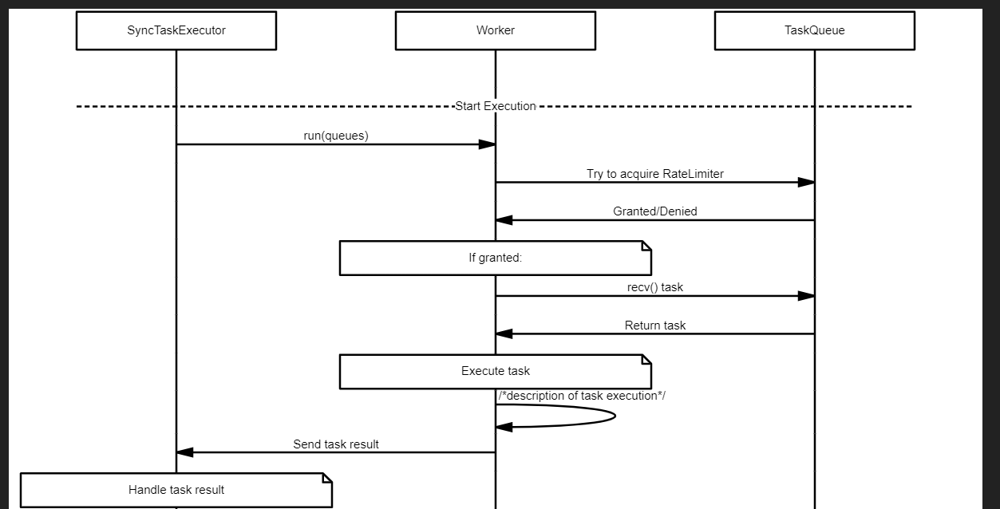

# Sync Task Executor

`SyncTaskExecutor` is the central coordination entity that manages the execution of synchronization tasks. It consists of a pool of `Worker` objects, each responsible for executing tasks. The execution of tasks is monitored by `SyncTaskExecutor` using message passing via tokio channels.

### Entities:

- `Worker`: Responsible for executing tasks. Each worker communicates with the `SyncTaskExecutor` by sending the result of each task execution. The worker can handle multiple tasks concurrently. Each worker is capable of executing any task that is given to it, though the tasks are chosen based on a scheduling strategy.
- `DatasetQueue`: A queue dedicated to storing sync tasks for a particular dataset. It is bound to a `RateLimiter` that helps maintain the limits imposed by the data vendor.

### Value Objects:

- `Task`: The atomic unit of work that a worker executes.

### Major Components:

- `SyncTaskExecutor`: Responsible for coordinating the workers and monitoring their progress, handling their results, and reacting to errors.
- `RateLimiter`: A mechanism to prevent exceeding the rate limit imposed by data vendors.

The `SyncTaskExecutor` starts workers, each of which tries to execute tasks by receiving them from the `DatasetQueue`, respecting the rate limit. When the execution is done, the `Worker` sends the result back to the `SyncTaskExecutor`, which then handles the result. It checks for errors, and if any are found, it decides if the task needs to be retried or not based on the remaining retry count of the task.

The entire design is intended to be asynchronous, built around the `async/await` feature of Rust and the async runtime provided by Tokio, making the best use of system resources and providing high throughput.

## Sequence



## High Level Implementation

The `SyncTaskExecutor` is essentially responsible for coordinating the workers and monitoring their progress, handling their results, and reacting to errors. To achieve these requirements, you can make use of various Rust and Tokio features, like channels for communication and sharing state, and `async`/`await` for managing concurrent tasks.

Given these additional requirements, here's a rough sketch of the updated `SyncTaskExecutor` and `Worker` implementation:

```rust
use std::collections::HashMap;
use std::time::Instant;
use tokio::sync::{Semaphore, mpsc};
use tokio::task;

// Assume Task is the type of tasks
// Let's add a retry field
struct Task {
    retries_left: u32,
    // other fields here
}

// Assume Data is the type of the fetched data
struct Data {
    // fields here
}

struct DatasetQueue {
    queue: mpsc::Receiver<Task>,
    rate_limiter: Semaphore,
    freeze_until: Option<Instant>, // new field
    // other fields as needed
}

// Worker now has an additional sender for results
struct Worker {
    id: usize,
    task: Option<task::JoinHandle<()>>,
    result_sender: mpsc::Sender<(usize, Result<Data, String>)>, // (worker_id, Result)
}

impl Worker {
    async fn run(&mut self, queues: HashMap<String, DatasetQueue>) {
        self.task = Some(tokio::spawn(async move {
            loop {
                // round-robin or other scheduling algorithm
                for dataset_queue in queues.values() {
                    if !dataset_queue.is_frozen() && dataset_queue.rate_limiter.try_acquire().is_ok() {
                        if let Some(mut task) = dataset_queue.queue.recv().await {
                            // execute task
                            let result = /* task execution here */;
                            self.result_sender.send((self.id, result)).await.unwrap();
                            if result.is_err() && task.retries_left > 0 {
                                task.retries_left -= 1;
                                // enqueue the task back for a retry
                                dataset_queue.queue.send(task).await.unwrap();
                            }
                        }
                    }
                }
            }
        }));
    }
}

struct SyncTaskExecutor {
    workers: Vec<Worker>,
    result_receiver: mpsc::Receiver<(usize, Result<Data, String>)>,
    // other fields as needed
}

impl SyncTaskExecutor {
    async fn start(&mut self) {
        for worker in &mut self.workers {
            worker.run(/* pass the queues */).await;
        }

        while let Some((worker_id, result)) = self.result_receiver.recv().await {
            match result {
                Ok(data) => {
                    // handle the successful case
                    // send data to the message queue
                },
                Err(error) => {
                    // handle the error case
                    // report the error
                }
            }
        }
    }
}
```

The `SyncTaskExecutor` now has a receiver for the results. Each worker has a sender and sends the result of each task to the `SyncTaskExecutor`. The `SyncTaskExecutor` handles these results in its `start` method.

Please note that this is just a simple design, and real implementation would need more considerations and detailed design according to the specific requirements of your project.s
